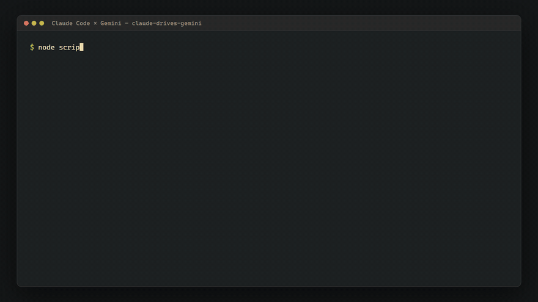

# claude-drives-gemini

[English](README.md) | [简体中文](README.zh-CN.md) | 日本語 | [한국어](README.ko.md)

Claude Code 用スキル:**Google AI Pro にログイン済みの Chrome** を AI エージェントに操作させ、Gemini ウェブ版で**画像(Nano Banana、2816×1536)/ 動画(Veo)/ 音楽(Lyria)**を生成します。生成物はロスレスでディスクに保存され、メディアのバイト列がエージェントのコンテキストに入ることは一切ありません。

**すでに支払っている Google Gemini のサブスクリプションを、そのまま追加の生産力に。**



## 特徴

- **コマンド 1 本で完結**:専用 Chrome の自動起動 → Pro + 拡張思考モードの確認 → プロンプト送信 → 段階を認識した待機 → ネイティブダウンロード。戻り値は 1 行の JSON。

- **リトライ戦略**:明確な拒否のときだけ安全に再送信し、タイムアウトは待機を延長するだけ、ダウンロード失敗はダウンロードのみ再試行。

- **フル解像度オリジナル**:2816×1536 のオリジナルをネイティブに直接ダウンロード。

  注:可視ウォーターマークは Gemini 本体で一度だけオフにできます(設定 → メディアの透かし → オフ — 公式機能)。以降のダウンロードはすべてクリーンです(不可視の SynthID は残ります — リスクの節を参照)。

## 前提条件

- Node ≥ 22 + Chrome + **Google AI Pro 以上のサブスクリプション**(ウェブ版の会員であり、API キーではありません)。
- Windows で実機検証済み。macOS / Linux は土台のみ実装済みで未検証です(フィードバック歓迎)。
- ネットワークから Google に正常にアクセスできる必要があります。
- UI テキストの照合は**中国語**インターフェースで検証済みです。`locales/en.json` は未検証の推測のため、実機での校正報告を歓迎します。

## クイックスタート

**おすすめ:Claude Code にインストールさせる。**以下をそのまま Claude Code に貼り付けてください:

> claude-drives-gemini をインストールして: https://github.com/MagicYangG/claude-drives-gemini を `~/.claude/skills/claude-drives-gemini` にクローンし、`node setup/init.mjs` でローカル設定を生成し、初回のログインを案内して、start-chrome ランチャーを実行し、最後に `node scripts/smoke.mjs` で環境を検証して。

手動インストールも 3 ステップです:

```bash
git clone https://github.com/MagicYangG/claude-drives-gemini ~/.claude/skills/claude-drives-gemini
cd ~/.claude/skills/claude-drives-gemini && node setup/init.mjs   # Chrome を検出し、config とランチャーを生成
```

1. **ログイン(初回のみ)**:`launchers/login-chrome.cmd|sh` を実行し、開いたクリーンなウィンドウで Google にログインして閉じます。(必ず*このウィンドウ*でログインしてください。デバッグポートを開いたウィンドウでは Google がログインを拒否します。)
2. **自動化用 Chrome の起動**:`launchers/start-chrome.cmd|sh` を実行します。
3. **検証**:`node scripts/smoke.mjs`(クォータ消費ゼロのスモークテスト:環境 → Chrome → ページを開く → コントロール探索)。
4. **生成**:Claude に「Gemini で画像を作って…」と伝えるだけ。あるいはコマンド 1 本:

```bash
node scripts/gemini-gen.mjs image "画像を直接生成してください:雨上がりの夕暮れ、水郷の街の石橋、水彩風。説明は不要です。" out/image.png
```

動画・音楽も同様で、`image` を `video` / `music` に置き換えるだけです。プロンプトには**明確な生成動詞**(「直接生成/作成してください」+「説明は不要」)が必須で、そうでないと Gemini にルーティングを誤られます。9:16 の縦型動画やスタイルテンプレートを使う場合は `--use-tool` を付けてください。可視ウォーターマークが不要なら Gemini 本体で一度だけオフに:設定(左下の歯車)→ メディアの透かし → オフ — 公式機能で、画像・動画・音楽すべてに適用されます。ステップごとのコマンドチェーンと全スクリプトの使い方は [`scripts/README.md`](scripts/README.md) にあります。

## ⚠️ リスクと免責事項(必読)

- 本プロジェクトは **Google とは無関係**です。コンシューマー版 Gemini ウェブの自動操作は **Google の利用規約に違反する可能性**があり、アカウント(特に有料サブスクリプション)が制限・停止されるリスクがあります。**自己責任でご利用ください**。公式 API の利用も検討してください。
- 組み込みの濫用防止規律:並列ではなく直列、スロットリングした生成、実キーボード・マウスイベント、クォータの尊重 — 並列連打に改造しないでください。
- ウォーターマーク:可視ウォーターマークは Gemini 公式の設定(設定 → メディアの透かし)で制御されます。**不可視の SynthID 来歴ウォーターマークはこの設定の影響を受けず、除去もできません**。生成物は引き続き追跡可能です。

## ディレクトリ構成

```
SKILL.md            # エージェントの入口:約 4KB のコア契約(段階的開示)
setup/init.mjs      # 初回セットアップ:Chrome 検出 → config 書き込み → ローカルランチャー生成
launchers/          # ランチャーテンプレート(*.tpl;init が start/login-chrome.cmd|sh を生成)
scripts/            # 全実行スクリプト + 運用マニュアル README.md
references/         # runtime-env(環境/ログイン/BAN 対策)· gemini-ui(セレクタの生きた記録)· quota-tiers · dewatermark
locales/            # UI テキスト照合(zh-CN 検証済み;en は校正待ち)
providers/          # v2.0 プロバイダ再構成の ADR
```

## License

MIT
